<h3><code>maviya@github ~ $ ./contributions.sh</code></h3>

  

<h3><code>maviya@github ~ $ whoami</code></h3>

  

<h3><code>maviya@github ~ $ neofetch</code></h3>

  

 

<h3><code>maviya@github ~ $ cat tech-stack.txt</code></h3>

**Languages**

**Generative AI & Agentic Systems**

**Machine Learning & Deep Learning**

**Full Stack & Backend**

**Data & Vector Stores**

**DevOps & Cloud**

 

<h3><code>maviya@github ~ $ cat featured-projects.txt</code></h3>

- ⚖️ **[LexMind](https://github.com/maviyashaikh25/Lawlense)** — Production 2-stage RAG legal intelligence engine over 50,000+ court judgments (Hit@5 >75%) using InLegalBERT, Pinecone, and fine-tuned BART summarization deployed on AWS EC2. &nbsp;•&nbsp; [Live Demo](http://13.53.75.87)
- 🤖 **[AgentDev](https://github.com/maviyashaikh25/agentic_sd_backend.git)** — 5-agent LangGraph orchestration platform automating code analysis, review, and file generation over pgVector with sub-2s latency via WebSockets. &nbsp;•&nbsp; [Live Demo](https://agentic-sd-frontend.vercel.app/)
- 🫀 **CardioSense** — Heart sound anomaly classification tool utilizing a PyTorch CNN on PhysioNet data with mel-spectrogram signal processing and a Dockerized FastAPI backend.

 

<h3><code>maviya@github ~ $ cat education.txt</code></h3>

- **Rizvi College of Engineering** — B.E. in Computer Science &nbsp;•&nbsp; *2023 — 2027* &nbsp;•&nbsp; **CGPA: 9.5/10**
- **D.G. Ruparel College** — HSC (Science) &nbsp;•&nbsp; *2021 — 2023* &nbsp;•&nbsp; **86.50%**

 

<code>maviya@github ~ $ echo "Thanks for visiting — let's build something."</code>

